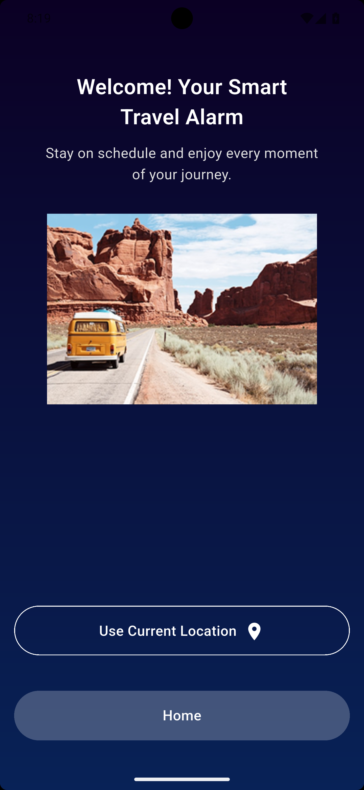
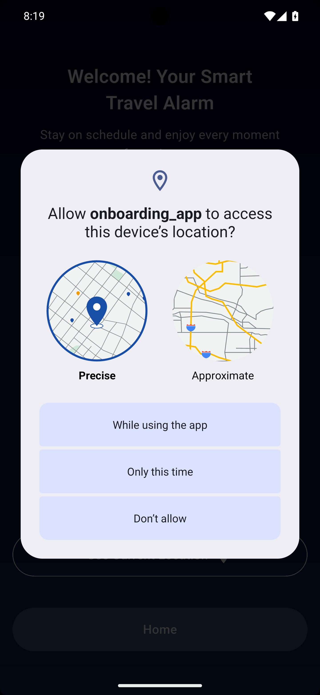
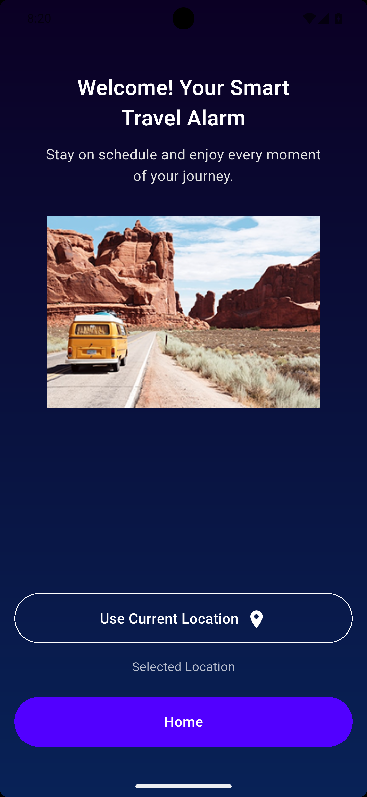
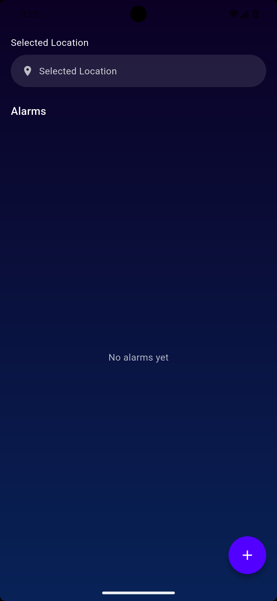
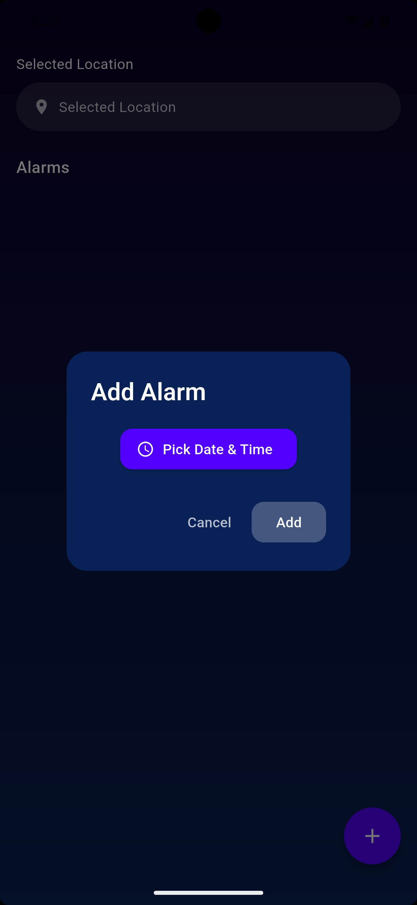
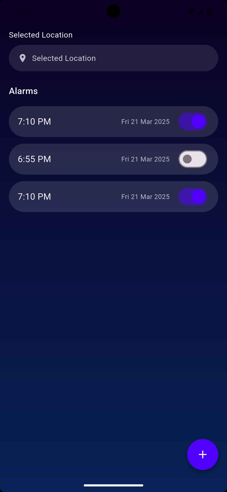

# Alarm Management App - Flutter Project

A feature-rich alarm management application built with Flutter, demonstrating clean architecture, state management with Provider, location services integration, and local notifications. This project was developed as part of a technical assessment for a Flutter Developer position.

## 📋 Table of Contents

- [Overview](#overview)
- [Features](#features)
- [Tech Stack](#tech-stack)
- [Project Structure](#project-structure)
- [App Flow](#app-flow)
- [Architecture](#architecture)
- [Setup Instructions](#setup-instructions)
- [Screenshots](#screenshots)

## 🎯 Overview

This alarm management application provides a seamless user experience from onboarding through alarm creation and management. The app integrates location services, implements persistent data storage, and delivers reliable alarm notifications using Flutter best practices.

## ✨ Features

- **Multi-screen Onboarding Flow**: Introduces users to key app features
- **Location Services Integration**: Requests and manages location permissions
- **Alarm Management**: Create, view, and manage multiple alarms
- **Local Notifications**: Scheduled notifications triggered at alarm time
- **Data Persistence**: Alarms saved locally and restored on app restart
- **Provider State Management**: Reactive UI updates across the application
- **Clean UI/UX**: Follows Material Design principles with custom theming

## 🛠 Tech Stack

- **Framework**: Flutter (Dart)
- **State Management**: Provider
- **Local Storage**: SharedPreferences / Hive
- **Notifications**: flutter_local_notifications
- **Location Services**: geolocator
- **Architecture Pattern**: Feature-first with Provider pattern
- **Design System**: Custom theme with Material Design components

## 📁 Project Structure

```
lib/
├── constants/
│ ├── app_colors.dart
│ ├── app_gradients.dart
│ └── app_text_styles.dart
│
├── common_widgets/
│ ├── dot_indicator.dart
│
├── helpers/
│ ├── notification_helper.dart
│ └── storage_helper.dart
│
├── providers/
│ ├── onboarding_provider.dart
│ ├── location_provider.dart
│ └── alarm_provider.dart
│
├── features/
│ ├── onboarding/
│ │ └── presentation/
│ │  ├── onboarding_screen.dart
│ │  └── onboarding_page.dart
│ │
│ ├── location/
│ │ └── presentation/
│ │  └── location_screen.dart
│ │
│ └── alarm/
│  └── presentation/
│   ├── alarm_screen.dart
│   └── add_alarm_dialog.dart
│
└── main.dart

presentation/
├── onboarding1.png
├── onboarding2.png
├── onboarding3.png
├── location1.png
├── location2.png
├── location3.png
├── alarm1.png
├── alarm2.png
└── alarm3.png
```

## 🚀 App Flow

### 1️⃣ Onboarding Flow

Users are introduced to the app through a three-step onboarding experience that explains the core purpose and features of the application.

<p align="center">
  
  
  
</p>

---

### 2️⃣ Location Setup Flow

After completing onboarding, users are guided through the location permission flow required for the app to function correctly.

<p align="center">
  
  
  
</p>

---

### 3️⃣ Alarm Management Flow

Once the location is set, users can create and manage alarms using a clean and intuitive interface.

<p align="center">
  
  
  
</p>


## 🏗 Architecture

### State Management with Provider

The application uses the Provider package for state management across three main providers:

#### OnboardingProvider
- Manages onboarding page navigation
- Tracks current page index
- Handles transitions between onboarding screens
- Navigates to location screen upon completion

#### LocationProvider
- Manages location permission state
- Fetches and stores user location data
- Handles permission request flow
- Provides location data to other features

#### AlarmProvider
- Manages alarm list state
- Handles CRUD operations for alarms
- Triggers UI updates via `notifyListeners()`
- Coordinates with notification service
- Persists alarm data to local storage

### Data Persistence

**Alarm Storage:**
- Alarms are serialized and stored locally using SharedPreferences or Hive
- Each alarm is saved with: time, label, status, and unique ID
- Data is loaded on app startup and synchronized with Provider state
- Persistent storage ensures alarms survive app restarts

### Notification System

**Scheduled Notifications:**
- Integration with `flutter_local_notifications` package
- Platform-specific notification channels (Android/iOS)
- Alarms schedule notifications at specified times
- Notification permissions handled gracefully
- Background execution for reliability

### Feature-First Organization

Each feature module contains:
- **Presentation**: Screens and UI components
- **Models**: Data structures and entities
- **Services**: Business logic and external integrations
- **Widgets**: Feature-specific reusable components
- **Dialogs**: Modal interfaces for user input

This structure promotes:
- Clear separation of concerns
- Easy feature scalability
- Independent module testing
- Reduced coupling between features

## 📦 Setup Instructions

### Prerequisites

- Flutter SDK (3.0.0 or higher)
- Dart SDK (2.17.0 or higher)
- Android Studio / Xcode (for platform-specific builds)
- Git

### Installation Steps

1. **Clone the repository**
   ```bash
   git clone <repository-url>
   cd alarm-app
   ```

2. **Install dependencies**
   ```bash
   flutter pub get
   ```

3. **Configure Android (if building for Android)**
    - Minimum SDK: API 21 (Android 5.0)
    - Update `android/app/build.gradle` if needed

4. **Configure iOS (if building for iOS)**
    - Minimum iOS version: 12.0
    - Run `pod install` in the `ios/` directory

5. **Run the application**
   ```bash
   flutter run
   ```

### Platform-Specific Setup

**Android:**
- Ensure location permissions are declared in `AndroidManifest.xml`
- Configure notification channels for Android 8.0+

**iOS:**
- Add location usage descriptions in `Info.plist`
- Configure notification permissions

## 📸 Screenshots

All UI screenshots are available in the `presentation/` folder, documenting each screen state and user flow throughout the application.

## 🔧 Dependencies

Key packages used in this project:

- `provider`: State management
- `flutter_local_notifications`: Alarm notifications
- `geolocator`: Location services
- `shared_preferences` / `hive`: Local data storage
- `intl`: Date and time formatting

## 🎯 Development Focus

This project demonstrates:

- **Clean Code Practices**: Readable, maintainable code structure
- **State Management**: Proper Provider implementation with separation of concerns
- **UI/UX Implementation**: Pixel-perfect design matching specifications
- **Platform Integration**: Native services (location, notifications)
- **Data Persistence**: Reliable local storage implementation
- **Error Handling**: Graceful permission and error state management

## 📄 License

This project was developed as part of a technical assessment.

---

